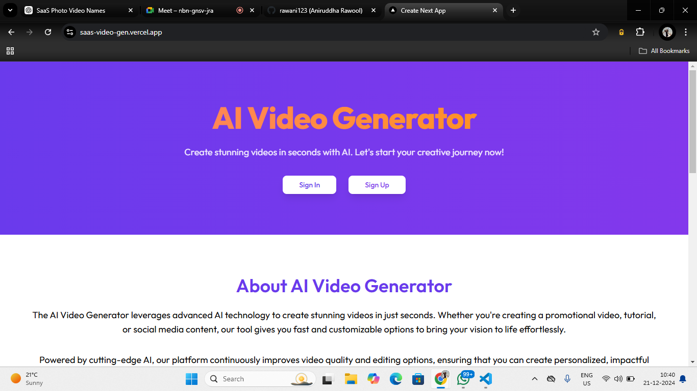
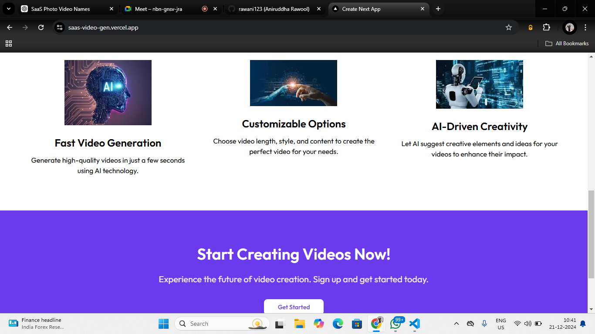
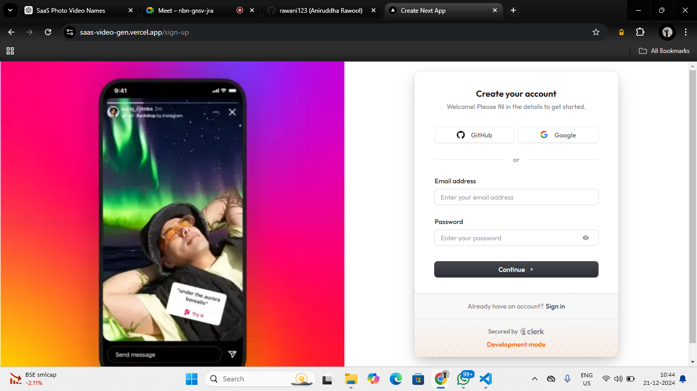
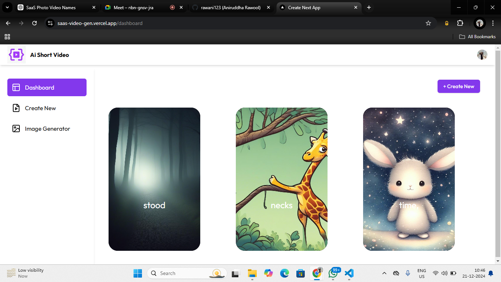
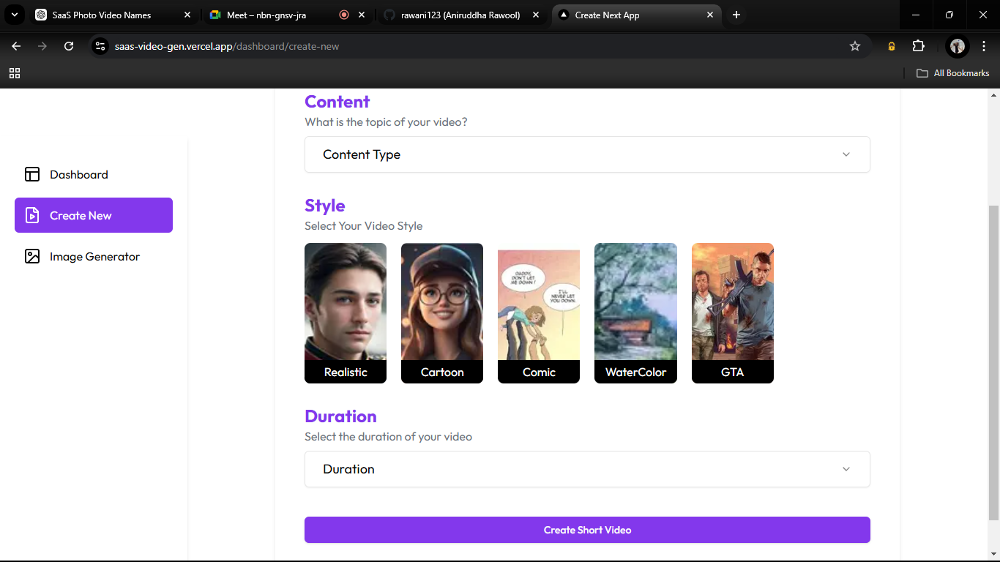
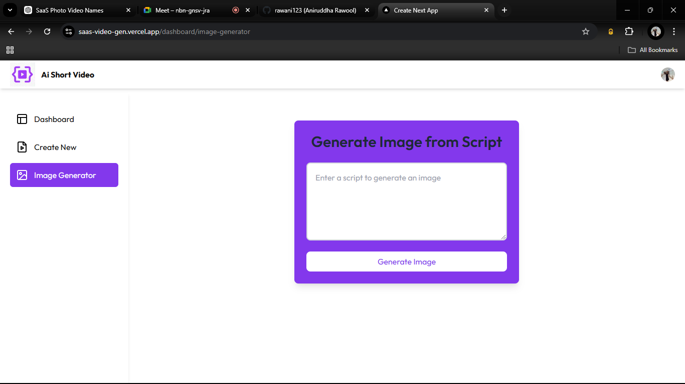
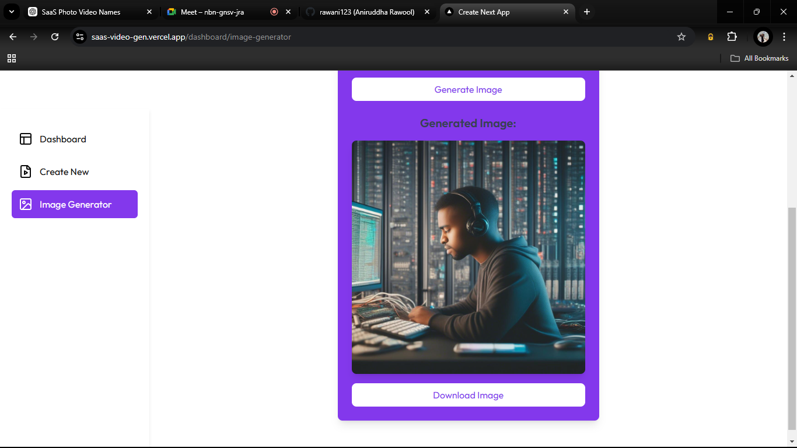

# **SaaS Video & Photo Generator**

---

### **Description**

A cutting-edge SaaS platform designed to generate high-quality photos and videos effortlessly. Powered by state-of-the-art technology, this tool is perfect for creatives, marketers, and businesses looking to streamline media production.

---

### **Features**

- **AI-powered photo and video generation**
- **High-quality generated photo download**
- **User-friendly interface for easy customization**
- **High-resolution outputs for professional use**
- **Scalable architecture for enterprise users**
- **Integration-ready APIs for developers**

---

### **Getting Started**

1. **Clone the Repository**

   ```bash
   git clone https://github.com/rawani123/saas-video-gen.git
   ```

2. **Install Dependencies**  
   Navigate to the project directory and install dependencies:

   ```bash
   cd saas-video-gen
   npm install
   ```

3. **Run the Application**  
   Start the development server:

   ```bash
   npm run dev
   ```

4. **Run Python File**

   ```bash
   cd backend
   python main.py
   ```

5. **Build for Production**  
   To create a production build:
   ```bash
   npm run build
   ```

---

### Tech Stack

#### Frontend

- **Next.js**: Used for its server-side rendering and static site generation, which enhance performance and improve SEO.
- **Tailwind CSS**: Provides a utility-first CSS framework that enables rapid and consistent design implementation.
- **Remotion.js**: Enables dynamic video creation directly in React, allowing for easy customization and integration into the platform.

#### Backend

- **Node.js**: Facilitates the creation of scalable and efficient APIs to handle concurrent requests and support real-time features.
- **Flask**: Integrates AI/ML models seamlessly with the backend to process video and image generation tasks efficiently.

#### Database

- **PostgreSQL**: A robust relational database system that handles structured data, ensuring reliability and scalability for storing user profiles, project metadata, and analytics.

#### AI/ML

- **HuggingFace API**: Provides state-of-the-art pre-trained models for image and video generation, reducing development time and delivering high-quality results.

#### Deployment

- **Vercel**: Perfect for deploying the Next.js frontend, offering serverless functions and optimized performance.
- **Render**: A reliable platform for hosting Flask-based backend applications, ensuring scalability and consistent uptime.

---

### Screenshots

#### Landing Page





---

#### Sign Up



---

#### Dashboard



---

#### Video Generator



---

#### Image Generator



---

#### Generated Image



---

### **License**

This project is licensed under the MIT License. See the LICENSE file for details.

---

### **Contact**

For questions or suggestions, please contact:  
**Author**: Aniruddha Rawool  
**Email**: [rawoolaniruddha3@gmail.com](mailto:rawoolaniruddha3@gmail.com)
